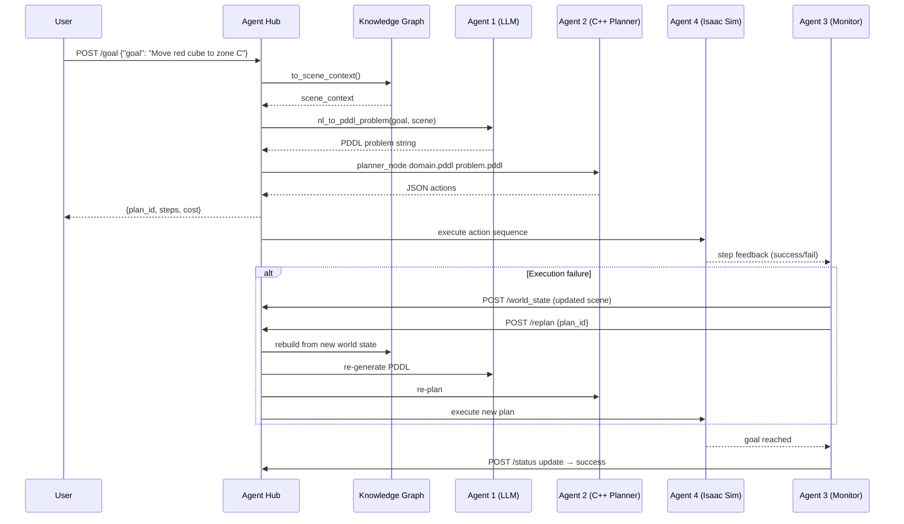

# ThePlanner — Data Flow Diagram

## End-to-End Pipeline

```mermaid
flowchart TD
    User([User / Operator])
    Hub["Agent Hub\n(FastAPI — agent_hub.py)\nPOST /goal"]
    KG["Scene Knowledge Graph\n(knowledge_graph.py)\nNetworkX DiGraph"]
    LLM["Agent 1 — LLM Reasoner\n(nl_to_pddl.py)\nOllama · LLaMA-3 8B"]
    VAL{PDDL valid?}
    FB["Fallback Template\n(_build_fallback_pddl)"]
    PDDL[(PDDL Problem\n.pddl string)]
    DOM[(PDDL Domain\ntabletop.pddl)]
    Parser["C++ PDDL Parser\n(pddl_parser.cpp)\nrecursive-descent"]
    Ground["Grounder\n(pddl_parser.cpp)\ncross-product instantiation"]
    AStar["Agent 2 — A* Planner\n(astar_planner.cpp)\nbitset state space"]
    GA["GA Plan Ranker\n(ga_ranker.cpp)\nminimise steps + cost"]
    PlanJSON[(JSON Plan\nactions list)]
    Store["In-memory Plan Store\n(PlanRecord)"]
    Isaac["Agent 4 — Isaac Sim 5.1\nROS2 Jazzy bridge\n(stub)"]
    Monitor["Agent 3 — Monitor\nPOST /world_state"]
    Replan["Replanner\nPOST /replan"]

    User -->|"Natural-language goal\ne.g. 'Move red cube to zone C'"| Hub
    Hub -->|to_scene_context| KG
    KG -->|scene_context dict\n{robot, objects, locations}| LLM
    LLM -->|few-shot prompted\nLLaMA-3 generate| VAL
    VAL -->|yes| PDDL
    VAL -->|no / LLM unavailable| FB
    FB --> PDDL
    DOM --> Parser
    PDDL --> Parser
    Parser --> Ground
    Ground -->|grounded actions\n+ init/goal bitsets| AStar
    AStar -->|optimal action sequence| GA
    GA -->|ranked plan| PlanJSON
    PlanJSON --> Store
    Store -->|plan_id + steps + cost| Hub
    Hub -->|GoalResponse| User
    User -->|GET /plan/{id}| Store

    Store -->|action sequence| Isaac
    Isaac -->|execution feedback| Monitor
    Monitor -->|updated scene_context| KG
    Monitor -->|triggers| Replan
    Replan -->|new goal + current KG| Hub
```

---

## Layer Breakdown

### Layer 1 — Natural Language Input

| Component | File | Role |
|---|---|---|
| Agent Hub | `ros2_bridge/src/agent_hub.py` | REST entry point; receives NL goal string |
| Scene KG | `llm_agent/src/knowledge_graph.py` | Converts graph state to `scene_context` dict |

The `scene_context` dict has the schema:
```json
{
  "robot": "franka",
  "objects": [
    {"name": "red_cube", "type": "object", "at": "zone_a"},
    {"name": "glass_sphere", "type": "object", "at": "zone_c", "fragile": true}
  ],
  "locations": ["zone_a", "zone_b", "zone_c"]
}
```

---

### Layer 2 — LLM Reasoning (Agent 1)

| Component | File | Role |
|---|---|---|
| `nl_to_pddl_problem()` | `llm_agent/src/nl_to_pddl.py` | Sends few-shot prompt to Ollama |
| `_is_valid_pddl()` | same | Structural validation (parens, required sections) |
| `_build_fallback_pddl()` | same | Template-based fallback if LLM fails |

**Data transformations:**
```
NL goal string + scene_context dict
    → formatted prompt (SYSTEM_PROMPT + user message)
    → Ollama HTTP POST → llama3:8b
    → raw text response
    → strip markdown fences
    → validate PDDL structure
    → PDDL problem string
```

---

### Layer 3 — Classical Planning (Agent 2)

| Component | File | Role |
|---|---|---|
| PDDL Parser | `planner/src/pddl_parser.cpp` | Recursive-descent; reads domain + problem |
| Grounder | same | Cross-product of action schemas × object tuples |
| A* Planner | `planner/src/astar_planner.cpp` | Bitset state, h = unsatisfied goal count |
| GA Ranker | `planner/src/ga_ranker.cpp` | Evolves population of plans; minimises cost |

**Data transformations:**
```
domain.pddl + problem.pddl
    → parse → PredicateIndex, State (bitset), GroundedAction[]
    → A* search (h = #unsatisfied goals)
    → plan: GroundedAction[]
    → GA rank (minimise steps + collision risk)
    → JSON output: {"actions": [{"step":0,"name":"pick(...)","cost":1.0}, ...]}
```

---

### Layer 4 — Execution & World-State Feedback (Agents 3 & 4)

| Component | Role |
|---|---|
| Isaac Sim 5.1 | Executes each action in simulation |
| ROS2 Jazzy bridge | Sends action commands, receives joint/camera feedback |
| `POST /world_state` | Agent 3 pushes updated scene; KG rebuilt |
| `POST /replan` | Hub replans with updated KG if execution fails |

---

## Replanning Loop


