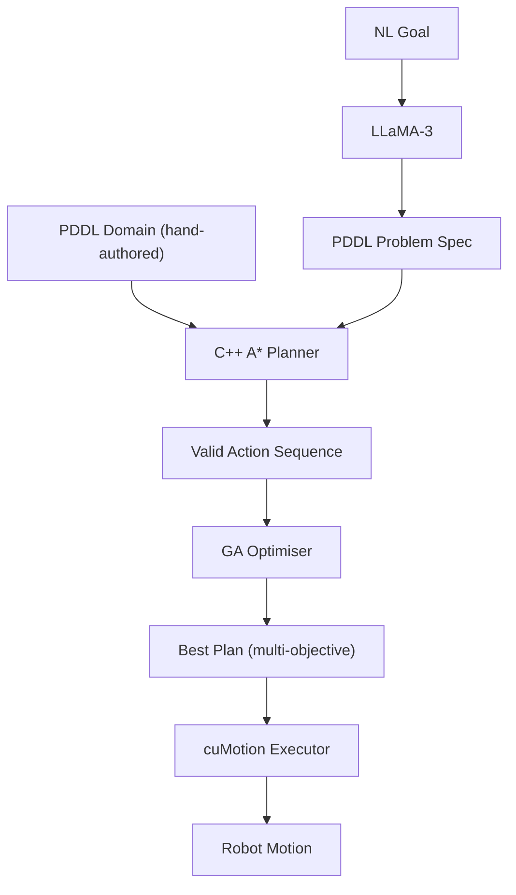
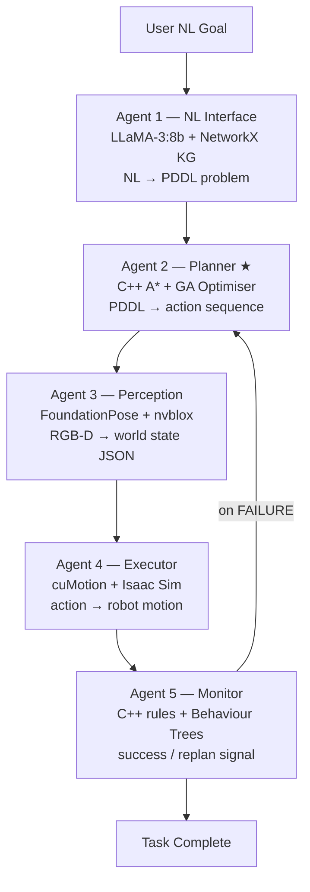
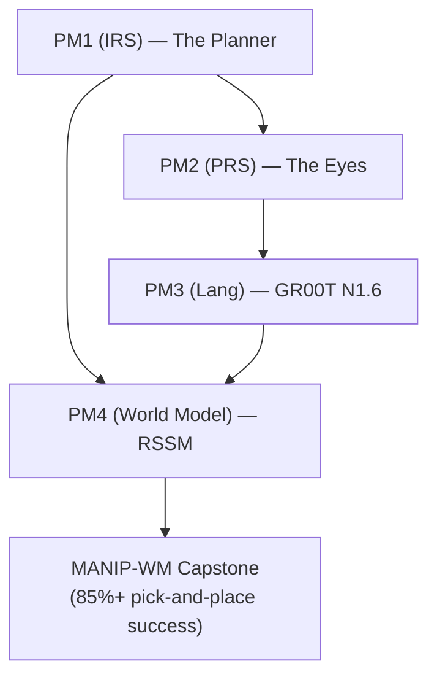

## Problem Statement


:::::: {.columns}
::: {.column width="60%"}
**Industrial scenario:**

- Warehouse/hospital logistics robots must be **reprogrammed for every new task variant**
- A single robot work cell requires **3–6 weeks** of programming time by a specialist engineer at $80k–$120k/year
- When task specs change — new products, new layouts — **the cycle repeats**
- Global industrial robot installations exceeded **500,000 units in 2023** (IFR World Robotics Report)
:::
::: {.column width="40%"}
**The gap:**

Robots today execute instructions. They cannot *reason* about goals.

**Target:** An operator says:

*"Stack the red cube on the blue cylinder"*

→ Robot plans autonomously, replans on failure
:::
::::::

::: notes
60 sec. All figures from IFR / proposal — cite if asked. The word "reason" is the IRS hook — use it deliberately.
:::

## Market Context

### Market Opportunity

| Metric | Value | Source |
|---|---|---|
| Global warehouse automation market by 2027 | USD 41B | MarketsandMarkets, 2023 |
| Hospital logistics robots market CAGR | 15% | Proposal market research |
| Global industrial robot installations (2023) | 500,000+ units | IFR World Robotics Report |
| Engineer cost per work cell | 3–6 weeks @ $80k–$120k/yr | Proposal market research |

**Unmet need:** No open-source, interpretable, LLM-integrated task planner running **fully local** on commodity GPU hardware.

**The Planner targets:** Zero licensing cost · Offline operation · Explainable plans

::: notes
60 sec. All figures are from the proposal's cited sources — defensible if challenged. "Fully local" differentiates from GPT-4-dependent solutions.
:::

## Existing Approaches & Why Not

### What Exists Today — And Why It Falls Short

| Approach | Tools | Limitation | Gap |
|---|---|---|---|
| Pre-built symbolic planners | FastDownward, FF | External executables — does not show search mastery | IRS PM requires implementing search, not invoking a planner |
| Pure LLM planning | GPT-4, LLaMA alone | Hallucinated actions; unverifiable plans | No formal correctness guarantee |
| Behaviour Trees only | Nav2, BT.cpp | Hard-coded; no search | Cannot handle novel task combinations |
| RL / model-based RL | DreamerV3, TD-MPC2 | Millions of env steps; uninterpretable | Impractical for sparse-reward manipulation |
| MoveIt/OMPL only | MoveIt2 + OMPL | Motion-only; no task reasoning | No PDDL; no goal decomposition |

**Key insight:** LLMs → language. Symbolic planners → correctness. **The Planner combines both.**

::: notes
2 min. Walk the table row by row. Pause on "hallucinated actions" — panel will likely probe this.
:::

## Why This Approach


:::::: {.columns}
::: {.column width="38%"}

:::
::: {.column width="62%"}
**Why C++ from scratch (not FastDownward)?**

- FastDownward is GPL v3 open-source — invoking it as an external executable does not demonstrate A* mastery
- IRS PM rewards a direct implementation of search algorithms
- Custom A* exposes state-space expansion, heuristic design, and cost function

**Why LLaMA-3 local (not GPT-4 API)?**

- Zero API cost; zero data egress; offline capable
- NL→PDDL is a bounded task — 8B parameters sufficient
- ~5–6 GB VRAM, fits on RTX 5070 Ti alongside Isaac Sim
:::
::::::

::: notes
60 sec. Anticipate "why not just use FastDownward?" — answer is already on this slide.
:::

## IRS Technique Coverage

### All 4 IRS Technique Groups Covered

| # | Technique Group | Implementation | Agent |
|---|---|---|---|
| ① | Decision Automation | Custom C++ PDDL A* Planner — state-space search with typed preconditions/effects | Agent 2 ★ |
| ② | Resource Optimisation | Genetic Algorithm plan ranker — minimises `steps×w₁ + time×w₂ + collision_risk×w₃` | Agent 2 ★ |
| ③ | Knowledge Discovery | FoundationPose 6-DoF pose estimator + nvblox SDF scene map | Agent 3 |
| ④ | Cognitive Systems | LLaMA-3:8b (local) NL→PDDL + NetworkX knowledge graph (affordances, relations) | Agent 1 |

★ Agent 2 (C++ Planner) is the **primary technical contribution** — built from first principles, no external planner binary.

::: notes
30 sec. Read the table. Emphasise ① and ② are both in Agent 2 — this is the differentiator.
:::

## System Architecture


:::::: {.columns}
::: {.column width="52%"}

:::
::: {.column width="48%"}
**Integration bus:** ROS2 topics + FastAPI REST

**Web UI:** React + Three.js 3D viewer + D3.js plan timeline

**Replanning loop:** on failure, Agent 5 signals Agent 2 to replan with updated world state — this is what makes it an *intelligent* system, not just a script.
:::
::::::

::: notes
90 sec. Walk the arrows. Emphasise the replanning loop — this is what makes it an intelligent system, not just a script.
:::

## Agent 1: NL Interface


:::::: {.columns}
::: {.column width="48%"}
**Components:**

- **LLaMA-3:8b** via Ollama — local, Q4_K_M quantised, ~5–6 GB VRAM including KV cache
- **NetworkX knowledge graph** — nodes: objects + robot; edges: affordances (`graspable`, `stackable`, `fragile`, `too-heavy`)
- **PDDL validator layer** — catches malformed output; falls back to template generator

**Failure handling:** LLaMA-3 invalid PDDL → VAL rejects → template fallback triggers
:::
::: {.column width="52%"}
**Example NL → PDDL:**

| Input | PDDL Output |
|---|---|
| *"Stack the red cube on the blue cylinder"* | `(:goal (on red-cube blue-cylinder))` |
| *"Move all fragile objects to the safe zone"* | `(:goal (forall (?o) (when (fragile ?o) (at ?o safe-zone))))` |
:::
::::::

::: notes
45 sec. One example is enough. Mention VAL validator — shows rigour.
:::

## Agent 2: Planner ★ (Core Contribution)


:::::: {.columns}
::: {.column width="55%"}
```cpp
// C++17 — PDDLPlanner::solve()
while (!open.empty()) {
  auto [state, g, h] = open.pop();
  if (problem_.goal.satisfiedBy(state))
    return reconstruct(state);
  for (auto& a : domain_.applicable(state)) {
    auto next = a.applyEffects(state);
    float f = g + a.cost + heuristic(next);
    open.push({next, g + a.cost,
               heuristic(next), f});
  }
}
```

**Heuristic:** `(goal & ~current).count()` — admissible → A* guarantees optimal plan length
:::
::: {.column width="45%"}
**GA Plan Optimiser:**

- Population: valid A* plan candidates
- Fitness: `min(steps×w₁ + est_time×w₂ + collision_risk×w₃)`
- Output: Pareto-optimal plan for execution

**PDDL Domain:** 5 actions

`pick` · `place` · `stack` · `move-to` · `inspect`
:::
::::::

::: notes
90 sec. Show the code snippet — it demonstrates direct implementation of A*, not a library wrapper. Be ready to explain admissibility.
:::

## Agents 3, 4, 5


:::::: {.columns}
::: {.column width="33%"}
**Agent 3 — Perception**

- FoundationPose: 6-DoF pose estimation, no fine-tuning required
- nvblox: live SDF obstacle map from depth stream
- Omniverse Replicator: synthetic domain-randomised RGB-D
- Output: world state JSON `{id, pose_6dof, class, affordances}`
:::
::: {.column width="34%"}
**Agent 4 — Executor**

- Isaac ROS cuMotion (MoveIt2 plugin): GPU-accelerated collision-free trajectory planning
- Isaac Sim: photorealistic physics, Franka Research 3 robot
- Up to **60× faster** than CPU-based planners (NVIDIA 2023)
:::
::: {.column width="33%"}
**Agent 5 — Monitor**

- C++ rule engine + ROS2 Behaviour Trees
- Failure classes: `grasp_failure`, `collision_detected`, `object_not_found`
- On failure: re-observe → update world state → trigger replan → Agent 2
- SQLite episode logging
:::
::::::

::: notes
60 sec. Keep this fast — these are supporting agents. The panel cares most about Agent 2.
:::

## Technology Stack

### NVIDIA-Only Stack — Zero Licensing Cost

| Layer | Technology | Rationale |
|---|---|---|
| Simulation | Isaac Sim (Omniverse) | Free via NVIDIA Dev Program; photorealistic |
| Motion Planning | Isaac ROS cuMotion + cuRobo | GPU-accelerated; up to 60× faster than CPU |
| Perception | FoundationPose + nvblox | SOTA 6-DoF; minimal per-object setup |
| Synthetic Data | Omniverse Replicator | Bundled; unlimited domain-randomised data |
| Task Planner | **Custom C++ PDDL A* + GA** | **Core technical contribution** |
| LLM Interface | LLaMA-3:8b via Ollama | Local; zero API cost; ~5–6 GB VRAM |
| Middleware | ROS2 Jazzy + FastAPI | Standard robotics bus |
| Knowledge Graph | NetworkX | Affordance encoding |
| Web UI | React + Three.js + D3.js | 3D viewer + plan timeline |

**Hardware:** Ryzen 9700X · 64 GB RAM · RTX 5070 Ti 16 GB VRAM

::: notes
45 sec. "Zero licensing cost" is a selling point — say it once clearly. Hardware spec reassures panel that this can actually run.
:::

## Benchmark & Evaluation

### 3 Benchmark Tasks + Failure Injection

| Task | NL Command | Success Criterion |
|---|---|---|
| T1 — Pick & Place | "Move the red cube to the green zone" | Object at target ±2 cm, no collision |
| T2 — Stacking | "Stack the blue cylinder on the yellow block" | Stable stack, no topple within 5 s |
| T3 — Conditional Sort | "Separate fragile objects from heavy ones" | All fragile→safe-zone, all heavy→staging |

:::::: {.columns}
::: {.column width="55%"}
**Failure Injection Tests:**

- Object slips mid-grasp → monitor detects → replan triggered
- Object disappears (simulated occlusion) → `object_not_found` → replan
- Gripper joint limit violation → `grasp_failure` → alternative grasp attempted
:::
::: {.column width="45%"}
**Metrics:**

- Task success rate (%)
- Plan generation time (ms)
- Replanning frequency per episode
- cuMotion trajectory optimisation time (ms)
:::
::::::

::: notes
60 sec. The replan loop on failure is what makes this an IRS system — emphasise it.
:::

## Timeline & Current Status

### Project Schedule

| Week | Dates | Milestone | Status |
|---|---|---|---|
| Wk 1 | Mar 14–21 | Repo setup, Isaac Sim install, PDDL domain design, C++ skeleton | ✅ Done |
| Wk 2 | Mar 22–28 | C++ A* core, PDDL parser, LLM prompt engineering, NetworkX KG | ✅ Done |
| **★ Wk 3** | **Mar 29** | **Proposal submission** | **✅ Submitted** |
| **★ Wk 4** | **Apr 5–11** | **Proposal presentation** ← *We are here* | 🔄 Now |
| Wk 4 cont. | Apr 5–11 | Isaac Sim scene, Franka URDF, FoundationPose pipeline | 🔄 In progress |
| Wk 5 | Apr 12–18 | End-to-end agent integration; 3 benchmark tasks | Planned |
| Wk 6 | Apr 19–25 | GA optimiser, monitor loop, FastAPI, React UI, 2 videos | Planned |
| **★ Wk 7** | **May 3** | **Final submission** (videos, report, peer review) | Planned |

::: notes
45 sec. Point to "We are here." Proposal is submitted and clean. Implementation starts this week.
:::

## Risks & Mitigations

### Known Risks — Already Addressed in Design

| Risk | Impact | Mitigation |
|---|---|---|
| VRAM contention (LLaMA + Isaac Sim + cuMotion) | System OOM | LLaMA-3 invoked only at task init; sequential. Total ~12–14 GB on 16 GB VRAM |
| LLaMA-3 produces invalid PDDL | Pipeline stall | VAL validator layer + template-based fallback generator |
| Isaac Sim install failure on Ubuntu 24.04 | Week lost | Pre-tested on RTX 5070 Ti. Fallback: cloud Isaac Sim (RunPod) |
| FoundationPose accuracy on novel objects | Poor scene state | PM1 uses Isaac Sim ground-truth poses — perception is PM2's scope |
| Solo workload (10 man-days) | Scope creep | Claude Code + 5 specialised subagents; each module independently testable |

::: notes
45 sec. Showing you've thought about failure modes signals engineering maturity. The VRAM budget is a concrete number — say it.
:::

## Conclusion


:::::: {.columns}
::: {.column width="52%"}
**Technical Contributions:**

1. **Custom C++ PDDL A* planner** — direct implementation of heuristic search, not a library wrapper
2. **Hybrid LLM + symbolic architecture** — LLM for language; PDDL for correctness
3. **GA multi-objective plan optimiser** — Pareto-optimal plan selection (steps, time, collision risk)
4. **Full 4-technique IRS coverage** in a single coherent pipeline

PM1 is the **load-bearing foundation** — the symbolic planner feeds every downstream module.

**Thank you. Questions welcome.**
:::
::: {.column width="48%"}
**Capstone Roadmap:**


:::
::::::

::: notes
30 sec. End on the capstone diagram — shows this feeds a larger system. Strong impression.
:::

## AI Usage Declaration

These slides were completed with assistance from Claude (Anthropic), used for structuring content and drafting responses. All content was reviewed and validated by the author.

## Appendix: Q&A Defence Notes

*Not presented — reference during Q&A*

**Q: Why not FastDownward / FF?**
FastDownward is GPL v3 open-source. The reason I didn't use it: IRS PM requires a direct implementation of search algorithms. Calling it as an external process produces a correct plan but demonstrates nothing about how A* works. Writing it from scratch in C++ — with state representation, heuristic, applicable action generator, and cost function exposed — is the demonstration.

**Q: Explain your heuristic. Is A* optimal?**
Admissible heuristic: `(goal & ~current).count()`. Since each unsatisfied fact requires at least one action, this never overestimates. A* with an admissible heuristic guarantees an optimal-length plan. The GA ranker then selects by secondary objectives (execution time, collision risk) — separate from planning optimality.

**Q: Why LLaMA-3 and not GPT-4?**
Zero API cost, zero data egress, offline operation. NL→PDDL is a bounded structured-output task — 8B parameters is sufficient. GPT-4 introduces API latency, cost, and network dependency for an on-robot system.

**Q: Solo project — how do you cover 5 agents?**
Claude Code orchestrator delegates to 5 specialised subagents, each owning one module with explicit I/O contracts and mock modes. I define all architecture decisions, review all generated code, and own all submissions.

**Q: What if Isaac Sim won't install in time?**
Mock mode is designed in from day one — every agent has a `--mock` flag. The planner runs end-to-end without Isaac Sim using a JSON scene stub. Isaac Sim is required only for the final demo video.

**Q: How does replanning work when perception fails?**
Agent 5 detects failure type — `grasp_failure`, `collision_detected`, or `object_not_found`. It signals Agent 3 to re-observe, updates the world state JSON, and re-invokes Agent 2 with the updated PDDL problem. The loop terminates on success or after 3 replan attempts.
